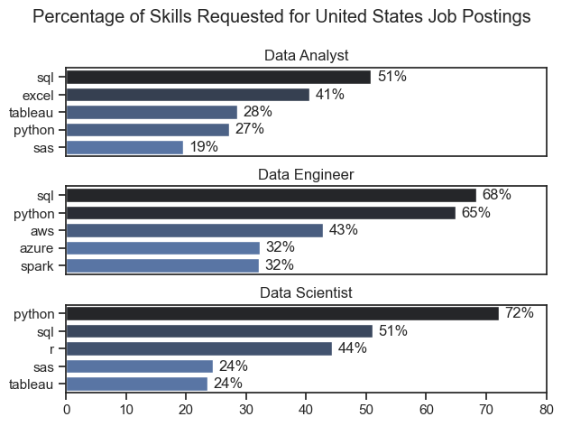
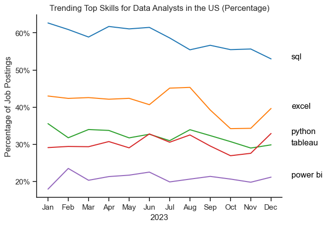

# Overview
Welcome to my analysis on the data job market, especially on the role of data analyst. This project was used to help people understand the data job market better and to help data analysts find optimal job opportunities.

# The Questions
These are the questions I want to answer in my project.

1. What are the skills most in demand for the top 3 most popular data roles?

2. How are in-demand skills trending for Data Analysts?

3. How well do jobs and skills pay for Data Analysts?

4. What are the optimal skills for data analysts to learn? (High Demand AND High Paying)

# Tools I used 
1. Python: Every calculation, cleaning the data and plotting was all done on Python. With the use of these libraries: Pandas, Metplotlib and Seaborn
2. Jupyter Notebook
3. Visual Studio Code
4. Git&Github
 
# Import and Clean Up the Data
I start by loading up the data cleaning up the data and import the necessary libraries.

# Filter US Jobs
Since the project will focus on job postings in the United States, I then filter the data to get the roles in the US.

# The Analysis
Each questions in this project is answer seperately in Jupyter notebook, below is how I approach each question:

# 1. What are the skills most in demand for the top 3 most popular data roles?

To answer this question, first I filtered out the positions to find the top 3 most popular roles. Then by highlighting the roles I can use the data to draw the plot. 
This is the detailed codes and steps of how I plot the chart:[2_Skill_Demand](2_Skill_Demands.ipynb)

# Visualize Data
```python
fig, ax = plt.subplots(len(job_titles),1)

sns.set_theme(style='ticks')
for i, job_title in enumerate(job_titles):
    df_plot = df_skill_perc[df_skill_perc['job_title_short'] == job_title].head(5)[::-1]
    sns.barplot(data=df_plot,x = 'skill_percent', y = 'job_skills', ax=ax[i], hue='skill_percent', palette='dark:b_r')
    ax[i].set_title(job_title)
    ax[i].invert_yaxis()
    ax[i].set_xlabel('')
    ax[i].set_ylabel('')
    ax[i].get_legend().remove()
    ax[i].set_xlim(0, 80)
     # remove the x-axis tick labels for better readability
    if i != len(job_titles) - 1:
        ax[i].set_xticks([])

    # label the percentage on the bars
    for n, v in enumerate(df_plot['skill_percent']):
        ax[i].text(v + 1, n, f'{v:.0f}%', va='center')
fig.suptitle('Percentage of Skills Requested for United States Job Postings')
fig.tight_layout(h_pad=0.8)
plt.show()
```

# Result

Bar plot illustrate the top 3 roles and the top 5 skills related to each one

# Insights
1. From the plot, we can see SQL is the most requested skill for all three positions, with it being required for about half of all the positions.
2. Data Engineer requires more specialized skills(aws, azure, spark) compare to data analyst and data scientist who are expected to be more proficient in more generalized data management and analysis tools(excel, sql)
3. Python is a versatile skill, highly demanded across all three roles, but most prominently for Data Scientists (72%) and Data Engineers (65%).

# How are in-demand skills trending for Data Analysts?
To find out the in-demand skills of the job postings in 2023, I filtered out data analysts positions and grouped the skills by month. 

# Visulaize data

```python
from matplotlib.ticker import PercentFormatter

df_plot = df_DA_US_percent.iloc[:,:5]
sns.lineplot(data=df_plot, dashes=False, legend='full',palette='tab10')
sns.set_theme(style='ticks')
sns.despine()

plt.title('Trending Top Skills for Data Analysts in the US (Percentage)')
plt.ylabel('Percentage of Job Postings')
plt.xlabel('2023')
plt.legend().remove()
plt.gca().yaxis.set_major_formatter(PercentFormatter(decimals=0))

for i in range(5):
    plt.text(12, df_plot.iloc[-1, i], df_plot.columns[i], color='black')
```


# Insights
1. SQL remains the most requested skill throughout the year though it shows a slow decrease.
2. Excel remains steady throughout the year though it slightly decrease in August and September, and Excel also surpass Python and Tableau throughout the entire year.
3. SQL, Excel, and Python are the top 3 most requested skills among all the job postings. With Python surpassing Tableau in November and shows an increasing trend after.